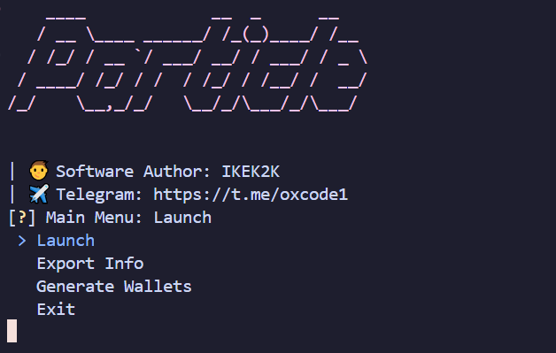

# ParticleNetwork
[](https://t.me/oxcode1)

✈️[Telegram Channel](https://t.me/oxcode1)



## 💡Функционал  
| Функционал                                                     | Поддерживается  |
|----------------------------------------------------------------|:---------------:|
| Многопоточность                                                |        ✅       |
| Локальная база данных                                          |        ✅       |
| Поддержка капчи CapMonster, Twocaptcha, AntiCaptcha            |        ✅       |
| Поддержка прокси любого формата (HTTP ONLY)                    |        ✅       |
| Загрузка списком REFCODE                                       |        ✅       |
| Поддержка всех сетей EVM                                       |        ✅       |
| Выполняет Daily CHECK-IN                                       |        ✅       |
| Выполняет DEPOSIT UNIVERSAL GAS                                |        ✅       |
| Выполняет USE UNIVERSAL GAS TO TRANSACT (100 транзакций/24ч)   |        ✅       |
| Сбор информации об аккаунте и кошельках EVM                    |        ✅       |
| Экспорт информации об аккаунтах в txt, excel                   |        ✅       |
| Генерация кошельков EVM                                        |        ✅       |
| И прочее :)                                                    |        ✅       |

## [⚙️Настройки](https://github.com/NikeAK/ParticleNetwork/blob/main/data/config.py)
| Настройка                  | Описание (см. config.py)                                                  |
|----------------------------|---------------------------------------------------------------------------|
| **MAIN_NETWORK**           | Выберите основную сеть, указав число                                      |
| **DEPOSIT_USDG**           | Укажите числа [min, max] для суммы депозита USDG в вашей сети             |
| **DEPOSIT_PRATICLE**       | Укажите числа [min, max] для суммы пополнения ParticleWallet в вашей сети |
| **MAKE_TRANSACTIONS**      | Накручивать 100 транзакций для выполнение ежедневного задания?            |
| **MAX_GAS_USDG**           | Максимальный газ USDG для оплаты, у каждой сети сильно отличается.        |
| **TRANSFER_AMOUNT**        | Укажите числа [min, max] для суммы перевода при накрутки транзакций.      |
| **DELAY_TRANSACTIONS**     | Укажите числа [min, max] для выставления задержки между транзакциями.     |
| **RANDOM_TX**              | Включить случайные транзакции?                                            |
| **TIMEOUT_PROXY**          | Максимальное время ожидания при проверке прокси в секундах                |
| **REQUEST_ATTEMPTS**       | Количество попыток при не удачных запросах                                |
| **CAPTCHA_API_KEY**        | Ключ качи                                                                 |
| **GET_ALL_BALANCES**       | Получать актуальный баланс всех EVM сетей?                                |
| **DELAY_ALL_BALANCES**     | Задержка в сек. между получением баланса в 1 сети/1 кошелька              |
| **EXPORT_DATA**            | Используемые данные для экспорта                                          |
| **EXPORT_SEPARATOR**       | Символ разделения данных для экспорта в TXT                               |

## 📝Краткий пояснение
...

## ⚡️Быстрый запуск
1. Запустите $\color{orange}{\textsf{Setup.bat}}$. Этот скрипт автоматически создаст виртуальное окружение, активирует его, установит все необходимые зависимости из файла requirements.txt и удалит не нужные файлы.
2. После успешного выполнения $\color{orange}{\textsf{Setup.bat}}$, вы можете запустить $\color{orange}{\textsf{Main.bat}}$. Этот скрипт активирует виртуальное окружение и запустит софт.

## 🛠️Ручная установка
```shell
~ >>> python -m venv Venv              #Создание виртуального окружения
~ >>> Venv/Scripts/activate            #Активация виртуального окружения
~ >>> pip install -r requirements.txt  #Установка зависимостей
~ >>> python main.py                   #Запуск
```

## 💰DONATION EVM ADDRESS: 
**0x1C6E533DCb9C65BD176D36EA1671F7463Ce8C843**

